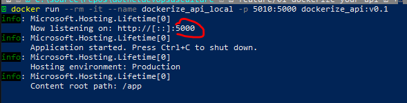

# Dockerize your dotnet API

Remember we talked about not being able to access you API on your local host, now we are going to create a docker image and accessit via our browser.
Word of advice, there is a great extension for docker for windows called docker by Microsoft that really makes things easy for you. 


Here you can find a [youtube tutorial](https://www.youtube.com/watch?v=wQSuZFd01tY&t=1353s) explaining the ins and outs.
> In my case it creates it inside de src/my_api_project and need to move it to root folder where the .dockerignore file is created

## Creating a Docker image

First thing you need to do is to build your docker images. Piece of advice... tag it or else you will go nuts to find it.


You would build your docker image with something like the following command
```
docker build -t your_image_tag:your_version_tag .
```


The former command has many parts: 
1. docker build (telling docker to build an image) 
2. -t image_tag:version_tag we asign a tag for ease when latter spinning up containers 
3. the dot (.) means at the current directory (without the dot nothing works)


In this very sample I went with dockerize_api:v0.1 for a tag

Bear in mind that this will take a long time the first time and less the following provided that you don't change your docker file.

## Spin up a debug container

To run your docker container you need to run the following command: 
```
docker run --rm -it --name your_container_name -p local_port:image_port your_image_tag:your_version_tag 
```
 The former command has many parts: 
 1. docker run (telling docker to spin up a dev environment  container) 
 2. --rm remove container once finished (you don't need to stop and remove the container yourself)
 3. -it (interactive, so you can see your log console to spot any bugs) 
 4. --name your_container_name ease when stopping and removing containers 
 5. -p local_port:image_port to be able to access your container through your browser you need a local port mapped to your image port 
 6. your_image_tag:your_version_tag remember tag from docker build? that is where we use it

I like to name my containers image_tag_environment (in this very instance it would be dockerize_api_local). 

Another thing that I like is to change the port on my local environment just to know what I'm doing, so I mapped local port 5010 to image port 5000 so I know that I need to type localhost:5010 at my local browser despite logs telling me that my local is http://localhost:5000



## Enjoy 

Now the only remaining thing to do, is to open up your browser an type http://localhost:5010/weatherforecast

[Back](../README.md)