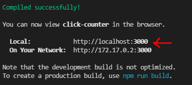

# Dockerize your front end

At my job we use react as our main front end technology. So, in order to see clearly 
many features of docker containers we will use react. 

## Why now dotnet?

Dotnet needs to complie to reflect changes and in this particular instance we need
to make changes while running our application.

Therefore for this example we will need node installed, npm and npx

## Create a new react app 

* Create a [new react app](https://reactjs.org/docs/create-a-new-react-app.html#:~:text=npx%20on%20the%20first%20line%20is%20not%20a,you%20don%E2%80%99t%20need%20to%20know%20anything%20about%20them.) with npx

Once you have created your app you must check that it works with npm start

### `npm start`

Runs the app in the development mode.\
Open [http://localhost:3000](http://localhost:3000) to view it in the browser.

### Dockerize your app

* Create a docker file at he root folder
* Get a node container image from docker hub
* Create your work dir 
* Copy package.json and Run npm install (this is for efficency an catching steps so next time it doesn't take so long)
* Copy all contents from your project to the work directory the first dot (.) means everythings form my local machine at the current folder, the second dot means at your work directory
* Expose your port (we are using 3000, look above)
* Run npm start just as you did on your local machine

This is all the steps you need to dockerize your app.
To keep things easy we will use docker for windows as our main environment.
**Imortant**: you should also have a .dockerignore file to speed things up

### Build your docker image

To build your docker image you need to run the following command:
´´´
docker build -t your_image_tag:your_version_tag .
´´´
The former command has many parts:
1 docker build (telling docker to build an image)
2 -t **image_tag**:*version_tag* we asign a tag for ease when latter spinning up containers 
3 the dot (.) means at the current directory (**without** the **dot nothing works**)

Bear in mind that this will take a long time the first time and less time at the following provided that you don't change your docker file.
For this veri sample I used **click_counter** as my *image tag* and **v0.1** for may *version tag*

### Run a container from your docker image
To run your docker container you need to run the following command:
´´´
docker run -it --name your_container_name -p local_port:image_port your_image_tag:your_version_tag
´´´
The former command has many parts:
1 docker run (telling docker to spin up a dev environmet container)
2 -it (interactive, so you can see your log console to spot any bugs)
3 --name **your_container_name** ease when stopping and removing containers
4 -p **local_port**:*image_port* to be able to access your container through your browser you need a local port mapped to your image port
5 your_image_tag:your_version_tag remember tag from docker build? that is where we use it

I like to name my containers **image_tag**_*environment* (in this particular instance it would be click_counter_local). Another
thing that I like is to change the port on my local environment just to know what I'm doing, so I mapped local port 3010 to image port 3000
so I know that I need to type localhost:3010 at my local browser despite logs telling me that my local is http://localhost:3000

To stop your container you either click Ctrl+c on your log console or open another powershell terminal and type:
´´´
docker stop your_container_name
´´´

To delete/remove your container 
´´´
docker rm your_container_name
´´´

To restart your continer you can go to docker for windows find your container an click start, or type the following command:
´´´
docker start your_container_name
´´´
## Create a click counter with react

* Create a counter app (button that counts clicks) we will use arrow functions syntax[arrow counter sample](https://www.robinwieruch.de/react-function-component)

[Back](../README.md)
